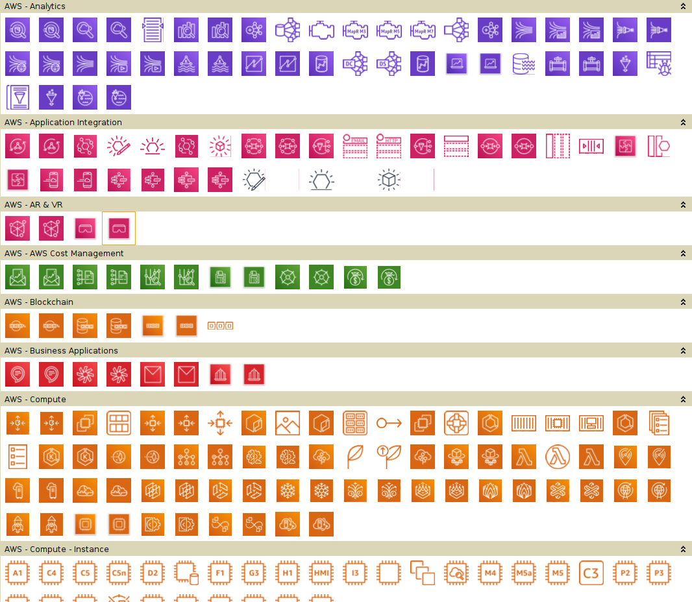

# AWS Simple Icons Palettes for yED

[yED](http://www.yworks.com/en/products/yfiles/yed/) is an awesome diagraming software. [AWS Simple Icons](https://aws.amazon.com/architecture/icons/) is an AWS-created icon set for use in architecture diagrams.

This repository contains pre-made palettes to import into yED to start diagramming with AWS Icons immediately!



# Support

## Updating yED with new icons

You can use "Import Section..." in yED as described [here](http://yed.yworks.com/support/manual/palette_manager.html).

- Inside yED, go to "Edit" > "Manage Palette..."
- Select "Import Section..."
- In the file dialog, select all of the `.graphml` files and select "Okay"

This should override any sections with the same name in yED.

### Deleting old palettes

You can use "Delete Section" in yED as described [here](http://yed.yworks.com/support/manual/palette_manager.html).

- Inside yED, go to "Edit" > "Manage Palette..."
- Select a single palette you want to delete
- Select "Delete Section"

## Updating this repository

This repo isn't automated (yet). So to manually update it, simply grab the latest URL and run the `update.sh` script:

```bash
# Grab latest URL from website
URL=$(curl -s https://aws.amazon.com/architecture/icons/ | grep '> SVG&nbsp;<i class="icon-download"></i>' | head -n1 | grep -oEi '//.*\.zip' | while read line; do echo "http:$line"; done)
echo "Latest URL: $URL"
# Run the updater, commiting the results
./update.sh "$URL" true
```
